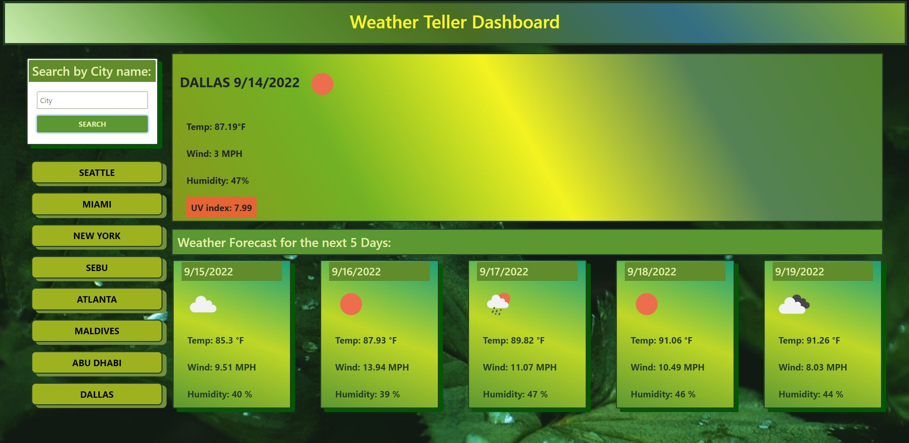

# Weather-Teller

### Welcome to Weather Teller ☂

 Your daily go-to application to check the weather based on provided <b>city name</b>. You can view the weather in your city, or even check how your buddys are doing anywhere in the world. The application shows the temperature, wind speed, humidity level and even UV index for the present day and for the next five days, so don't forget to re-apply your sunscreen if the UV indicator turns red!

The application was built using HTML, Bootstrap as a CSS framework, Moment.js, jQuery and, of course, JavaScript.
Openweathermap.org API was utilized to get the weather data. Application uses client-side local storage to store the information for the requested cities.

###### The application is currently deployed through GitHub pages.
###### Feel free to check out the screenshot of the app below and click on the link to use the app.

[Weather Teller](https://valkim55.github.io/Weather-Teller/) 

##### Thank you 🧡